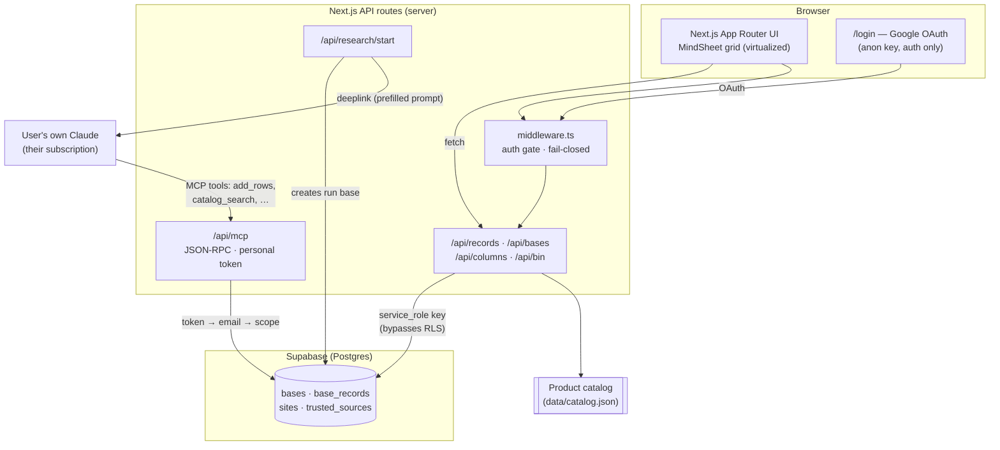

# AI-Researcher — architecture

A knowledge-base storefront over the AiVocado product catalog: a fast, spreadsheet-style
grid over nested bases, an AI research flow that runs on the **user's own** Claude
subscription, and an MCP connector that lets any Claude client read and edit the bases.

## System at a glance

## Layers

- **UI** (`app/`) — Next.js App Router, React 19. The table is `@aivocado/mindsheet`,
  a **virtualized** grid (only ~20 rows in the DOM out of thousands) shared with a
  second product (Fathom); all changes here are additive and opt-in so the other
  host is never disturbed.
- **API** (`app/api/`) — every data path is server-side. The browser never queries
  Postgres directly; it only uses the anon key for Google sign-in.
- **Data** (`lib/datasource/`) — one `DataSource` interface over two backends: an
  in-memory store (dev/tests) and Supabase (prod). The product catalog is a static
  JSON slice; user bases live in `bases` / `base_records`.
- **Auth** — Supabase Google OAuth, gated in `middleware.ts` (fail-closed: no keys on
  a deployment → 503, never open data). Access model: own + shared + ownerless bases.
- **Connector** — one HTTP MCP endpoint, 19 tools, authenticated by a personal token
  (`token → email → scope`). Same access model as the web.

## Variant C — research on the user's own subscription

The site never calls Claude with someone else's subscription (Anthropic forbids it).
Instead `/api/research/start` creates a private **run base** and returns a **deeplink**
that opens the user's own Claude with a ready-made prompt. Their Claude does the search
with its own tools + our connector, writes rows back via `add_rows`, and the site reads
that base. Every row must carry a primary-source link **and a verbatim quote** — cheap
for a human to spot-check, and not sold as automatic fact-checking.

## Security posture

- **Fail-closed auth gate**; public paths matched exactly, not by prefix (no `/loginXXX`).
- **RLS** on user tables: the app uses the `service_role` key (bypasses RLS), so enabling
  it costs nothing but blocks the public anon key from reading tables directly around the API.
- **Token model** for the connector: `token → email`, revocable instantly via env.
- **Adversarial test suite** (`tests/adversarial/`, 166 tests): CSV formula injection,
  prototype pollution, id spoofing, tenancy leaks, prompt-cost ceilings, path-traversal,
  input fuzzing — each attack is a passing test.

## Testing & CI

- **336 tests** (`vitest`), strict TypeScript (`tsc --noEmit` clean).
- **GitHub Actions** runs type-check + tests + build on every push and PR.

## Key decisions (the "why")

| Decision | Why |
|----------|-----|
| Research via deeplink to the user's Claude | Legally clean — no third-party use of a subscription; no server-side model cost. |
| Virtualized grid, shared as a package | One grid engine, two products; perf on thousands of rows without a heavy table lib. |
| service_role server-side + RLS on | App is simple and fast; RLS is defense-in-depth against the public anon key. |
| Attacks encoded as tests | A passing test = proof the hole is closed; regressions can't sneak back. |
| Manual, ordered migrations + checklist | The service key can't run DDL; the folder makes "shipped before the table existed" impossible to do silently. |

## Talking points for the demo

1. **Open the grid, filter, group, colour** — then note: only ~20 rows are in the DOM.
2. **Run a research** — show the deeplink opening *your* Claude; results flow back with quotes.
3. **Show `tests/adversarial/` + `REPORT.md`** — "we threat-model, and every attack is a test."
4. **Show the green CI check** — everything is verified on every push.
5. **Answer the data-isolation question** with RLS + the token→email scope.
