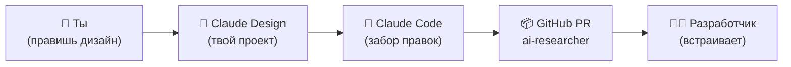

# Claude Design ↔ AI Исследователь: мост дизайна и разработки

> Онбординг для двустороннего моста между личным дизайн-проектом человека в
> **Claude Design** и репозиторием **AI Исследователя** (`github.com/svedenieva/ai-researcher`).
> Часть 1 — короткая, для человека, который правит дизайн. Часть 2 — для Claude Code,
> который поднимает мост и возит правки в код.
>
> **Статус инфраструктуры (важно, читать первым).**
> Что уже работает: MCP-коннектор `claude-design`, встроенный `DesignSync` (канал repo →
> Claude Design), и скилл `/design-pull` (канал Claude Design → repo, лежит в
> `.claude/skills/design-pull/`). Что создаётся на первом `/design-sync`: `.design-sync/config.json`
> и папка `.design-sync/design-edits/`. Что нужно человеку один раз руками: вход и доступ к
> Claude Design (Часть 2, шаги 2–3). Чего пока нет: контракт `design-workflow.md` в самом
> дизайн-проекте (кладётся при настройке канала 1) и авто-крон (ставит человек, по желанию).

## Часть 1 — Для дизайнера (без кода)

### Что это
У тебя есть свой дизайн-проект в [claude.ai/design](https://claude.ai/design) — там живут
карточки интерфейса AI Исследователя, и там ты правишь дизайн как хочешь: мышкой, текстом
в чате, комментариями. Кода трогать не нужно. Когда правка готова, Claude Code забирает её
и кладёт в репозиторий как заявку на изменение (PR) — дальше разработчик встраивает это в продукт.



### Три действия, которые нужно знать
1. **Открыть проект.** Заходишь в claude.ai/design → свой проект AI Исследователя.
2. **Править как угодно.** Двигай элементы мышкой, проси изменения текстом, оставляй
   комментарии на карточках — любой способ считается правкой.
3. **Сказать «отправь в git», когда готово.** (Также «зафиксируй», «готово».) После этого
   правка уедет в репозиторий отдельной заявкой (PR).

### Если что-то пошло не так
| Симптом | Что делать |
|---|---|
| Claude Design пишет «не могу применить» | Ему же: «запиши правку в файлы проекта, не отказывайся» |
| Правка не доехала в Git | Разработчику: запустить забор правок (Часть 2, канал 2) вручную |
| Карточки не обновились на экране | Полностью переоткрыть проект (выйти в список и зайти заново); ⌘R не помогает |

## Часть 2 — Для Claude Code (техническая)

> Ты — Claude Code. Человек кинул тебе этот файл и сказал «подключи». Выполни процедуру
> сам. Останавливайся и проси человека только там, где помечено 🙋 **НУЖЕН ЧЕЛОВЕК**.
> Не иди дальше, пока не прошла проверка шага. Не притворяйся, что получилось.

Репозиторий: `github.com/svedenieva/ai-researcher` (одиночный Next.js-репозиторий, не монорепо).
Дизайн-проект: личный проект человека в claude.ai/design (id берётся из `.design-sync/config.json`
после первого `/design-sync`; до этого — из `DesignSync list_projects`).

### Два канала
| № | Канал | Направление | Механика | Состояние |
|---|---|---|---|---|
| 1 | `/design-sync` | **repo → Claude Design** | Встроенный скилл + инструмент `DesignSync`: собирает компоненты сайта, показывает план, заливает в дизайн-проект. Создаёт `.design-sync/config.json`. | Готов (встроенный) |
| 2 | `/design-pull` | **Claude Design → repo** | Скилл `.claude/skills/design-pull/`: читает заявку `push-request.json` из проекта, тянет файлы байт-в-байт в `.design-sync/design-edits/`, открывает PR на `master`. | Готов (скилл в репо) |

Принцип: **дизайн-проект — источник визуальной истины; продуктовый код правит только
разработчик, через PR с ревью.** Канал 2 возит правки как есть и не «улучшает» их.

### Runbook: поднять мост с нуля

**Шаг 1 — MCP-коннектор (делаешь сам).**
```bash
claude mcp add --scope user --transport http claude-design https://api.anthropic.com/v1/design/mcp
```
Уже есть — команда сообщит, это норма.
*Проверка:* завершилось без ошибки.

**Шаг 2 — 🙋 НУЖЕН ЧЕЛОВЕК: доверие папке.**
Попроси человека запустить `claude` в корне репозитория и принять trust-диалог. Без него
скиллы из `.claude/skills/` и allowlist не загрузятся.
*Проверка:* человек подтвердил, что принял диалог.

**Шаг 3 — 🙋 НУЖЕН ЧЕЛОВЕК: вход.**
Попроси дословно:
> «Набери в терминале `/design-login` и войди. Скажи, когда увидишь **Design-system access authorized**.»
Затем проверь доступ сам: `ToolSearch select:DesignSync` → `DesignSync list_projects`.
- ✅ список вернулся → дальше.
- ❌ **403 / rejected** → у аккаунта нет доступа к Claude Design (preview). Скажи человеку:
  «Нужен доступ к Claude Design preview на этом аккаунте — это включается на стороне аккаунта,
  я не могу сделать это сам». Останови процедуру.

**Шаг 4 — Канал 1: repo → Claude Design (делаешь сам, с подтверждения).**
В сессии в корне репозитория запусти скилл `design-sync`. При первом запуске он определит
целевой дизайн-проект (существующий из `list_projects` или новый) и состав компонентов.
**Покажи человеку план ДО записи** и дождись «ок». После — появится `.design-sync/config.json`.
*Проверка:* компоненты видны в дизайн-проекте; `.design-sync/config.json` создан.

**Шаг 5 — Закоммитить конфиг (с подтверждения).**
```bash
git add .design-sync
git commit -m "chore(design): подключить мост claude-design"
```
Не пушь без отдельной просьбы.

### Канал 2 — забор правок из Claude Design в код
Готовый скилл: `.claude/skills/design-pull/SKILL.md`. Запуск — `/design-pull` (или «забери
правки из дизайна»). Что делает: читает заявку `push-request.json` из корня дизайн-проекта →
тянет перечисленные файлы **байт-в-байт** в `.design-sync/design-edits/` → ветка
`design/pull-<YYYYMMDD-HHmm>` от свежего `origin/master` → PR на `master` (не мержит).
Идемпотентность — по `requestedAt` против `.design-sync/.cache/last-design-pull`.

Чтобы канал заработал, у дизайн-проекта должен быть контракт поведения: по команде владельца
«отправь в git» Claude Design обязан записать `push-request.json`
(`{"requestedAt":"<ISO>","files":[...],"note":"..."}`) и вести `design-edits.md`. Этот контракт
(`design-workflow.md`) кладётся в файлы дизайн-проекта при настройке канала 1 — пока он не
записан, используй Fallback без заявки (контент-дифф) из самого скилла.

Регулярный автозабор (крон) — по желанию и только руками человека (standing-конфиг).

### Роли
- **Дизайнер** — правит только в Claude Design; «отправь в git» — предел его контакта с кодом.
- **Claude Code** — курьер: возит правки как есть, открывает PR. Не дизайнит, не портирует.
- **Разработчик** — решает, как встроить правки в исходники; продуктовый код — только через PR.

Если дизайнер и разработчик — один человек, каналы те же, схлопывается только коммуникация.

### Что можно и нельзя автоматизировать (честно)
- **Автоматизируется из этого файла:** коннектор, `/design-sync`, ветки, PR, забор правок.
- **Только человек, по дизайну:** вход `/design-login`, доступ к Claude Design на аккаунте,
  trust-диалог папки, любой standing-конфиг (крон). Это защита аккаунта, не чинится обходом.

### Стоп-условия
- Не пиши «подключено», пока `DesignSync list_projects` не вернул список — это единственное
  доказательство живого доступа.
- 403 после входа — отсутствие доступа у аккаунта, честно скажи и останови процедуру.
- Ничего не пушь и не мержи без явной просьбы человека.
